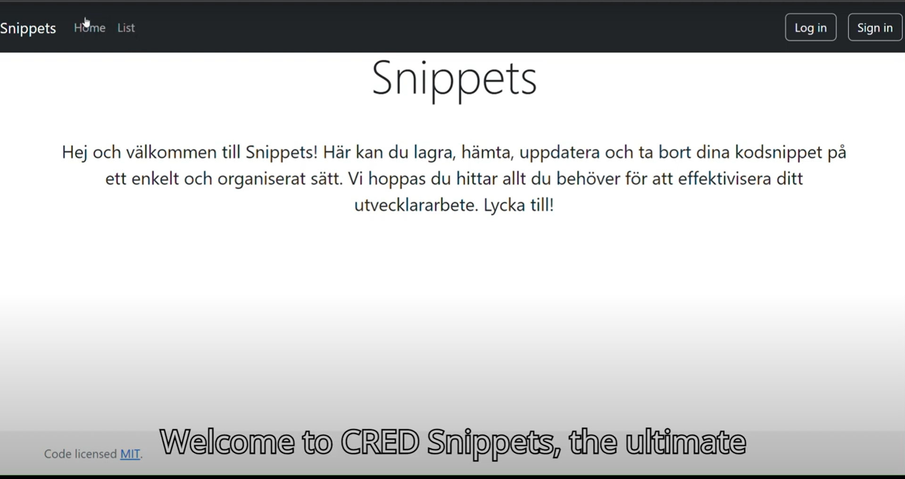

# CRUD Snippets


CRUD Snippets is a web application designed to help you organize and manage your code snippets efficiently. Built on the Node.js platform, it utilizes Express as the application framework and Mongoose for object data modeling with MongoDB.

## Features

- **Guest Access:** View available snippets without needing to log in.
- **Authenticated Access:** Register, log in, and gain full control over your snippets.
  - **Create**: Add new code snippets.
  - **Read**: View all available snippets.
  - **Update**: Edit snippets you have created.
  - **Delete**: Remove snippets you have created.

## Demo video
[](https://www.youtube.com/watch?v=PYpPo7TkbHw)

## Getting Started

1. **Register and Log In:**
   - Create a new account and log in to access the full functionality of the application.

2. **Manage Your Snippets:**
   - Once logged in, you can create new snippets.
   - On the main page, view all your snippets.
   - Edit or delete only the snippets you’ve created.

## Installation

1. **Clone the repository:**
```
git clone <repository-url>
```

2. **Navigate into the project directory:**
```
cd crud-snippets
```

3. **Create a `.env` file:**
  ```
PORT=3000
BASE_URL=http://localhost:3000
SESSION_NAME=mySessionID
SESSION_SECRET=yourSessionSecret
DB_CONNECTION_STRING=mongodb://localhost:27017/mydatabase
```
Update the `.env` file with your environment-specific settings (e.g., database connection strings, session secrets).


4. **Install dependencies:**
```
npm install
```


## Development

To run the application in development mode with live reloading:

```
npm run dev
```

To lint the code:
```
npm run lint
```

To automatically fix linting issues:
```
npm run lint:fix
```

### License
This project is licensed under the MIT License

### Contact
Vanja Maric
email: maricvanj@gmail.com